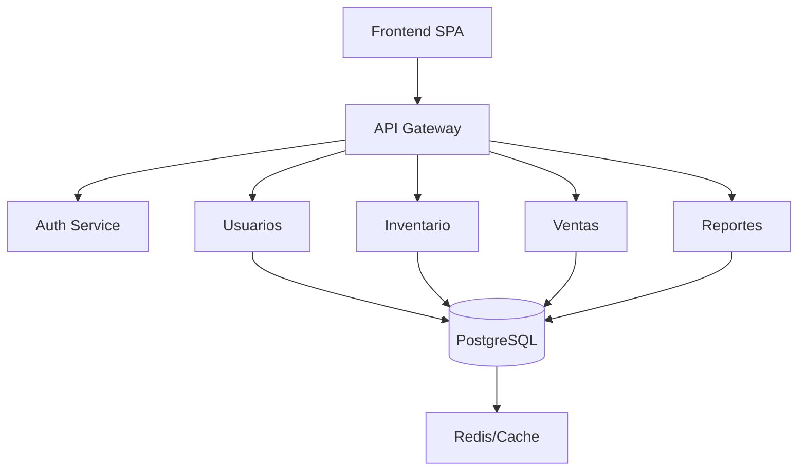

# 🛒 Proyecto 7: Sistema de Gestión de Inventario y Punto de Venta

---

<div align="center">

|  |  |  |
|:---:|:---:|:---:|

**Plataforma integral para la gestión de inventarios, ventas y facturación de PYMES.**

</div>

---

## 📚 Menú Rápido

<div align="center">

| [🦺 S-SDLC](#s-sdlc-secure-software-development-life-cycle) | [🏗️ Arquitectura](#arquitectura-cleanhexagonal--microservicios-o-modular-monolito) | [🚀 Funcionalidades](#requerimientos-funcionales-clave) | [🗂️ Modelo de Datos](#modelo-de-datos-sugerido) | [📆 Milestones](#milestones-semanales) | [🛠️ Stack](#tecnologías-sugeridas) |
|:---:|:---:|:---:|:---:|:---:|:---:|
| [🔌 Realtime](#realtime-y-comunicación) | [🧩 Prerrequisitos](#prerrequisitos-antes-de-comenzar) | [🛡️ SSH GitHub](#configurar-clave-ssh-para-github) | [📥 Clonar](#clonar-el-repositorio) | [🔄 Git Flow](#flujo-de-trabajo-con-git--github) | [🚩 PRs](#pull-requests) |
| [🖼️ Ayudas](#ayudas-visuales) | [🆘 Soporte](#dudas-o-problemas) |

</div>

---

## 📝 Descripción General

> Plataforma para propietarios, empleados y supervisores:  
> **Gestiona productos, ventas, stock y reportes en tiempo real.**

---

## 🦺 S-SDLC (Secure Software Development Life Cycle)

> **Seguridad en cada fase del desarrollo.**

| Fase                  | Descripción                                                                 |
|-----------------------|-----------------------------------------------------------------------------|
| 📝 Requerimientos     | Identificación de amenazas y requisitos de seguridad                        |
| 🏗️ Diseño            | Modelado de amenazas, controles y arquitecturas seguras                     |
| 💻 Programación       | Buenas prácticas de codificación y revisión de código                       |
| 🧪 Pruebas            | Tests automatizados/manuales, análisis de vulnerabilidades                  |
| 🚀 Despliegue/Mant.   | Monitoreo, parches y gestión de incidentes                                  |

[🔝 Volver al menú](#📚-menú-rápido)

---

## 🏗️ Arquitectura Clean/Hexagonal + Microservicios

<div align="center">



</div>

- **Clean/Hexagonal:** Dominios y lógica desacoplados.
- **Microservicios:** Módulos críticos escalables.
- **Monolito Modular:** Fácil migración a microservicios.

[🔝 Volver al menú](#📚-menú-rápido)

---

## 🚀 Funcionalidades Clave

<div align="center">

| Básicas                        | Avanzadas                  |
|:-------------------------------|:--------------------------|
| 🔐 Autenticación por roles      | ⚠️ Notificaciones auto.   |
| 📦 Gestión de inventario       | 📈 Dashboard realtime      |
| 🛍️ Punto de venta (POS)        | ↩️ Sistema de devoluciones |
| 🧾 Facturación electrónica      | 💳 Integración pagos       |
| 🏪 Control de sucursales        | 👀 Auditoría completa      |
| 📊 Reportes de ventas           |                            |
| 🚚 Gestión de proveedores       |                            |

</div>

[🔝 Volver al menú](#📚-menú-rápido)

---

## 🗂️ Modelo de Datos Sugerido

<details>
<summary><b>👤 users</b></summary>

| Campo        | Tipo                                   | Descripción              |
|--------------|----------------------------------------|--------------------------|
| id           | INT PRIMARY KEY                        | Identificador único      |
| email        | VARCHAR(255) UNIQUE                    | Email del usuario        |
| password     | VARCHAR(255)                           | Contraseña encriptada    |
| first_name   | VARCHAR(100)                           | Nombre                   |
| last_name    | VARCHAR(100)                           | Apellido                 |
| role         | ENUM('owner', 'supervisor', 'cashier', 'admin', 'auditor') | Rol          |
| ...          | ...                                    | ...                      |

</details>

<details>
<summary><b>🏢 branches</b></summary>

| id | name | address | phone | ... |
|----|------|---------|-------|-----|

</details>

<details>
<summary><b>📦 products</b></summary>

| id | sku | barcode | name | ... |
|----|-----|---------|------|-----|

</details>

<details>
<summary><b>🏬 inventory</b></summary>

| id | product_id | branch_id | current_stock | ... |
|----|------------|-----------|--------------|------|

</details>

<details>
<summary><b>🧾 sales</b></summary>

| id | invoice_number | branch_id | cashier_id | ... |
|----|---------------|-----------|------------|-----|

</details>

<details>
<summary><b>🛒 sale_items</b></summary>

| id | sale_id | product_id | quantity | ... |
|----|---------|------------|----------|-----|

</details>

<details>
<summary><b>🙍 customers</b></summary>

| id | customer_code | first_name | last_name | ... |
|----|--------------|------------|-----------|-----|

</details>

<details>
<summary><b>💻 user_sessions</b></summary>

| id | user_id | branch_id | ip_address | ... |
|----|---------|-----------|------------|-----|

</details>

[🔝 Volver al menú](#📚-menú-rápido)

---

## 📆 Milestones Semanales

<div align="center">

| Semana | 🎯 Entregable           | 🧩 Cobertura           |
|:------:|:-----------------------|:----------------------|
| **1**  | Arquitectura base      | Estructura WEB        |
| **2**  | Login, roles y permisos| Autenticación         |
| **3**  | Control de acceso      | Protección de rutas   |
| **4**  | Inventario y productos | CRUD                  |
| **5**  | Punto de Venta         | Validación, pagos     |
| **6**  | Dashboard dinámico     | Gráficos              |
| **7**  | Recuperación acceso    | Auditoría             |
| **8**  | Reportes y analytics   | Exportación           |
| **9**  | Optimización           | Seguridad             |
| **10** | Despliegue             | Documentación         |

</div>

[🔝 Volver al menú](#📚-menú-rápido)

---

## 🛠️ Stack Tecnológico

<div align="center">

| Frontend | Backend | API Gateway | DB | Realtime | Cache/Colas | Reports | Pagos |
|:--------:|:-------:|:-----------:|:--:|:--------:|:-----------:|:-------:|:-----:|
| React    | Node.js/Express | Kong/Nginx | PostgreSQL | Socket.IO | Redis/RabbitMQ | jsPDF/ExcelJS | Stripe/PayPal |

</div>

[🔝 Volver al menú](#📚-menú-rápido)

---

## 📚 Cobertura de Temas

- 🏗️ Estructura WEB
- 🔍 Búsquedas avanzadas
- ✔️ Validaciones
- 🔄 Actualizaciones dinámicas
- 🟢 Notificaciones realtime
- 🎞️ Animaciones
- 🛡️ Multirol empresarial
- 🔁 Multisesiones POS
- 🔑 Reset seguro
- 🚦 Autorización granular

[🔝 Volver al menú](#📚-menú-rápido)

---

## 🔌 Realtime y Comunicación

> **Socket.IO** para actualizaciones instantáneas de stock, ventas y notificaciones.

[🔝 Volver al menú](#📚-menú-rápido)

---

## 🧩 Prerrequisitos Antes de Comenzar

<div align="center">

| Software      | Descripción             | Enlace |
|---------------|------------------------|--------|
| 🟩 Node.js + npm | Entorno JS           | [Descargar](https://nodejs.org/en/download/) |
| 🐙 Git          | Control de versiones  | [Descargar](https://git-scm.com/downloads) |
| 🐱 GitHub       | Plataforma colaborativa | [Regístrate](https://github.com/join) |
| 🐳 Docker       | Automatización despliegues | [Descargar](https://www.docker.com/products/docker-desktop/) |
| 🐘 PostgreSQL/SQL Server | Base de datos | [SQL Server](https://www.microsoft.com/en-us/sql-server/sql-server-downloads) |

</div>

[🔝 Volver al menú](#📚-menú-rápido)

---

## 🛡️ Configurar clave SSH para GitHub

1. **Genera una clave SSH:**
   ```bash
   ssh-keygen -t ed25519 -C "tu_email@example.com"
   ```
2. **Agrega la clave al ssh-agent** (elige tu SO):

   - **Windows (Git Bash):**
      ```bash
      eval $(ssh-agent -s)
      ssh-add ~/.ssh/id_ed25519
      ```
   - **PowerShell:**
      ```powershell
      Start-Service ssh-agent
      ssh-add $env:USERPROFILE\.ssh\id_ed25519
      ```
   - **macOS:**
      ```bash
      eval "$(ssh-agent -s)"
      ssh-add --apple-use-keychain ~/.ssh/id_ed25519
      ```
   - **Linux:**
      ```bash
      eval "$(ssh-agent -s)"
      ssh-add ~/.ssh/id_ed25519
      ```

3. **Copia la clave pública y agrégala en GitHub > Settings > SSH and GPG keys.**

[🔝 Volver al menú](#📚-menú-rápido)

---

## 📥 Clonar el repositorio

```bash
git clone git@github.com:EdgarGmz/project-web.git
```
> 📂 Esto creará la carpeta `project-web` con todos los archivos.

[🔝 Volver al menú](#📚-menú-rápido)

---

## 🔄 Flujo de trabajo con Git & GitHub

- **main:** Producción
- **develop:** Integración
- **feature/**, **fix/**, **hotfix/**: Ramas de trabajo

```bash
git checkout develop
git pull
git checkout -b feature/nombre-issue
git add .
git commit -m "cambios"
git push origin feature/nombre-issue
```

[🔝 Volver al menú](#📚-menú-rápido)

---

## 🚩 Pull Requests

1. Sube tu rama.
2. Haz clic en **Compare & pull request**.
3. Selecciona `develop` como base.
4. Crea el PR.

[🔝 Volver al menú](#📚-menú-rápido)

---

## 🖼️ Ayudas Visuales

- [Guía oficial de GitHub para Pull Requests](https://docs.github.com/en/pull-requests)
- [Documentación de Node.js](https://nodejs.org/en/docs/)
- [Documentación de Next.js](https://nextjs.org/docs)
- [Guía rápida de Docker](https://docs.docker.com/get-started/overview/)

[🔝 Volver al menú](#📚-menú-rápido)

---

## 🆘 Dudas o Problemas

- Consulta la [documentación oficial de GitHub](https://docs.github.com/en)
- Contacta al equipo en el canal interno

[🔝 Volver al menú](#📚-menú-rápido)

---
