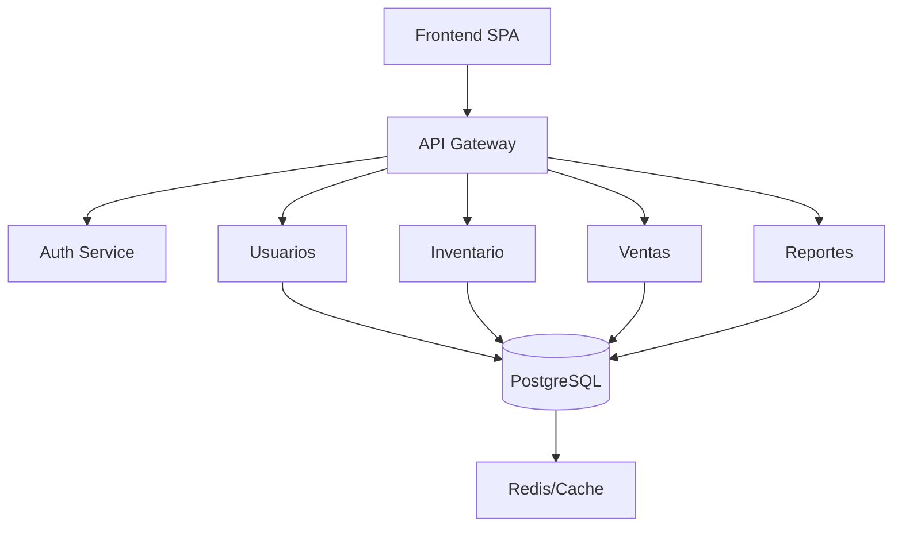

# 🛒 Proyecto 7: Sistema de Gestión de Inventario y Punto de Venta

---

<div align="center">

| 🗃️ Inventario | 💸 Ventas | 🧾 Facturación |
| :-----------: | :------: | :-----------: |
|   

## 🚀 Plataforma integral para la gestión de inventarios, ventas y facturación de PYMES.

</div>

---

## 🧭 Menú Rápido

<div align="center">

| [🏁 Inicio Rápido](#prerrequisitos-antes-de-comenzar) | [🗂️ Modelo de Datos](#modelo-de-datos-sugerido) | [🏛️ Arquitectura](#arquitectura-cleanhexagonal-microservicios) | [✨ Funcionalidades](#funcionalidades-clave) | [📅 Milestones](#milestones-semanales) | [🛠️ Stack](#stack-tecnologico) | [🔄 Realtime](#realtime-y-comunicacion) | [🌳 Git Flow](#flujo-de-trabajo-con-git-y-github) | [🔀 Pull Requests](#pull-requests) | [🖼️ Ayudas](#ayudas-visuales) | [❓ Soporte](#dudas-o-problemas) |

</div>

---


## 🛡️ S-SDLC (Secure Software Development Life Cycle)

> **Seguridad en cada fase del desarrollo.**

| 🏷️ Fase           | 📝 Descripción                                                |
| ----------------- | ------------------------------------------------------------ |
| 📋 Requerimientos | Identificación de amenazas y requisitos de seguridad         |
| 🏗️ Diseño         | Modelado de amenazas, controles y arquitecturas seguras      |
| 💻 Programación   | Buenas prácticas de codificación y revisión de código        |
| 🧪 Pruebas        | Tests automatizados/manuales, análisis de vulnerabilidades   |
| 🚀 Despliegue/Mant.| Monitoreo, parches y gestión de incidentes                  |

[🔝 Volver al menú](#menu-rapido)

---

## 🏛️ Arquitectura Clean/Hexagonal + Microservicios



* 🧩 **Clean/Hexagonal:** Dominios y lógica desacoplados.
* 🧱 **Microservicios:** Módulos críticos escalables.
* 🏗️ **Monolito Modular:** Fácil migración a microservicios.

[🔝 Volver al menú](#menu-rapido)

---

## ✨ Funcionalidades Clave

| 🛠️ Básicas             | 🚀 Avanzadas                  |
| :--------------------- | :--------------------------- |
| 🔐 Autenticación por roles | 🔔 Notificaciones automáticas |
| 📦 Gestión de inventario   | 📊 Dashboard realtime         |
| 🛒 Punto de venta (POS)    | ↩️ Sistema de devoluciones    |
| 🧾 Facturación electrónica | 💳 Integración pagos          |
| 🏬 Control de sucursales   | 🕵️ Auditoría completa         |
| 📈 Reportes de ventas      |                              |
| 🤝 Gestión de proveedores  |                              |

[🔝 Volver al menú](#menu-rapido)

---

## 🗂️ Modelo de Datos Sugerido

<details>
<summary>👤 users</summary>

| 🏷️ Campo    | 🗃️ Tipo                                                    | 📝 Descripción             |
| ------------ | ---------------------------------------------------------- | ------------------------- |
| 🆔 id        | INT PRIMARY KEY                                            | Identificador único       |
| 📧 email     | VARCHAR(255) UNIQUE                                        | Email del usuario         |
| 🔒 password  | VARCHAR(255)                                               | Contraseña encriptada     |
| 🧑 first\_name | VARCHAR(100)                                               | Nombre                    |
| 👨 last\_name  | VARCHAR(100)                                               | Apellido                  |
| 🏷️ role      | ENUM('owner', 'supervisor', 'cashier', 'admin', 'auditor') | Rol                       |
| 🆔 employee\_id | VARCHAR(20) UNIQUE                                         | ID de empleado            |
| 📞 phone     | VARCHAR(20)                                                | Teléfono                  |
| 📅 hire\_date | DATE                                                       | Fecha de contratación     |
| 🏢 branch\_id | INT FOREIGN KEY                                            | ID de sucursal asignada   |
| 🛡️ permissions | JSON                                                       | Permisos específicos      |
| ✅ is\_active | BOOLEAN                                                    | Estado activo             |
| 🕒 last\_login | TIMESTAMP                                                  | Último acceso             |
| 🔑 reset\_token | VARCHAR(255)                                               | Token de reset            |

</details>

<!-- Resto de tablas de datos siguen el mismo patrón, eliminando emojis en encabezados -->

[🔝 Volver al menú](#menu-rapido)

---

## 📅 Milestones Semanales

| 📆 Semana | 📦 Entregable              | 📊 Cobertura           |
| :-------: | :------------------------ | :--------------------- |
|    1      | 🏗️ Arquitectura base       | 🕸️ Estructura WEB      |
|    2      | 🔑 Login, roles y permisos | 🔐 Autenticación       |
|    3      | 🚦 Control de acceso       | 🛡️ Protección de rutas |
|    4      | 📦 Inventario y productos  | 📝 CRUD                |
|    5      | 🛒 Punto de Venta          | 💳 Validación, pagos   |
|    6      | 📊 Dashboard dinámico      | 📈 Gráficos            |
|    7      | 🔄 Recuperación acceso     | 🕵️ Auditoría           |
|    8      | 📑 Reportes y analytics    | 📤 Exportación         |
|    9      | ⚡ Optimización            | 🔒 Seguridad           |
|   10      | 🚀 Despliegue              | 📚 Documentación       |

[🔝 Volver al menú](#menu-rapido)

---

## 🛠️ Stack Tecnologico

| 🖥️ Frontend |     🖧 Backend     | 🚪 API Gateway | 🗄️ DB      | 🔄 Realtime | 🗃️ Cache/Colas  | 📑 Reports      | 💳 Pagos        |
| :---------: | :---------------: | :------------: | :--------: | :---------: | :-------------: | :-------------: | :-------------: |
|   ⚛️ React  | 🟩 Node.js/Express |  🌉 Kong/Nginx | 🐘 PostgreSQL | 🟣 Socket.IO | 🟥 Redis/RabbitMQ | 📄 jsPDF/ExcelJS | 💸 Stripe/PayPal |

[🔝 Volver al menú](#menu-rapido)

---

## 🔄 Realtime y Comunicación

> ⚡ **Socket.IO** para actualizaciones instantáneas de stock, ventas y notificaciones.

[🔝 Volver al menú](#menu-rapido)

---

## 🏁 Prerrequisitos Antes de Comenzar

| 💻 Software           | 📝 Descripción                | 🔗 Enlace                                                                        |
| --------------------- | ---------------------------- | ------------------------------------------------------------------------------- |
| 🟩 Node.js + npm      | Entorno JS                   | [Descargar](https://nodejs.org/en/download/)                                    |
| 🐙 Git                | Control de versiones         | [Descargar](https://git-scm.com/downloads)                                      |
| 🐱 GitHub             | Plataforma colaborativa      | [Regístrate](https://github.com/join)                                           |
| 🐳 Docker             | Automatización despliegues   | [Descargar](https://www.docker.com/products/docker-desktop/)                    |
| 🐘 PostgreSQL | Base de datos              | [SQL Server](https://www.microsoft.com/en-us/sql-server/sql-server-downloads)   |

[🔝 Volver al menú](#menu-rapido)

---

## 🌳 Flujo de trabajo con Git y GitHub

* `main`: 🚀 Producción
* `develop`: 🧪 Integración
* `feature/`, `fix/`, `hotfix/`: 🌱 Ramas de trabajo

```bash
git checkout develop
git pull
git checkout -b feature/nombre-issue
git add .
git commit -m "cambios"
git push origin feature/nombre-issue
```

[🔝 Volver al menú](#menu-rapido)

---

## 🔀 Pull Requests

1. ⬆️ Sube tu rama.
2. 🔄 Haz clic en Compare & pull request.
3. 🛠️ Selecciona develop como base.
4. 📝 Crea el PR.

[🔝 Volver al menú](#menu-rapido)

---

## 🖼️ Ayudas Visuales

* [📚 Guía oficial de GitHub para Pull Requests](https://docs.github.com/en/pull-requests)
* [📖 Documentación de Node.js](https://nodejs.org/en/docs/)
* [📘 Documentación de Next.js](https://nextjs.org/docs)
* [🐳 Guía rápida de Docker](https://docs.docker.com/get-started/overview/)

[🔝 Volver al menú](#menu-rapido)

---

## ❓ Dudas o Problemas

* Consulta la [📚 documentación oficial de GitHub](https://docs.github.com/en)
* 📢 Contacta al equipo en el canal interno

[🔝 Volver al menú](#menu-rapido)
