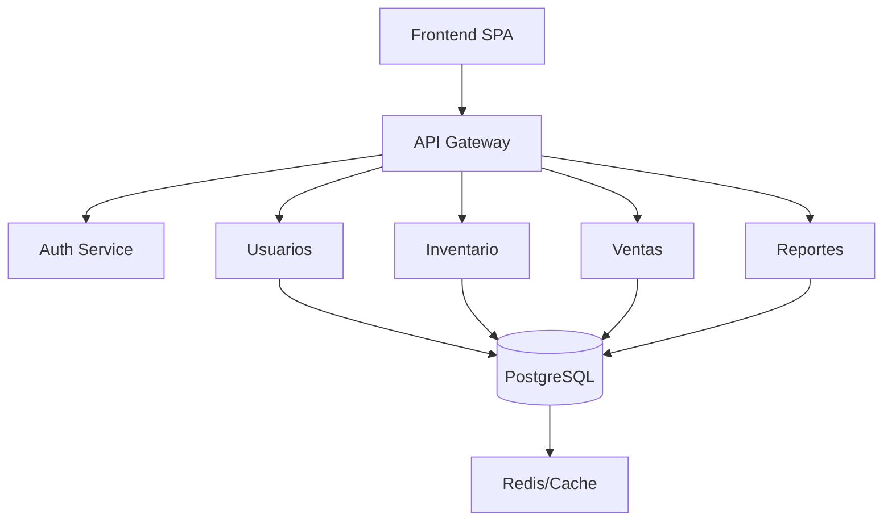

# 🚀 Backend

Bienvenido al backend del proyecto. Este servicio está construido con **Node.js** + **Express**, utiliza **PostgreSQL** como base de datos mediante un **ORM**, y sigue la arquitectura **Clean/Hexagonal** con enfoque en **Microservicios**.

## 🛠️ Tecnologías

| Tecnología         | ¿Por qué se utiliza?                                                                 | Link de descarga/documentación                  |
|--------------------|--------------------------------------------------------------------------------------|-------------------------------------------------|
| {width=32} <br/> **Node.js**        | Motor de ejecución para JavaScript en el backend, eficiente y escalable.             | [Descarga aquí](https://nodejs.org/)                |
| {width=32} <br/> **Express**        | Framework minimalista para crear APIs de forma rápida y sencilla.                    | [Documentación](https://expressjs.com/)         |
| {width=32} <br/> **PostgreSQL**     | Base de datos relacional robusta y de código abierto.                                | [Descarga aquí](https://www.postgresql.org/download/)|
| {width=32} <br/> **ORM**<br/>(Sequelize/TypeORM) | Facilita la interacción con la base de datos usando objetos y migraciones.           | [Sequelize](https://sequelize.org/)<br/>[TypeORM](https://typeorm.io/) |
| {width=32} <br/> **Arquitectura Clean/Hexagonal** | Permite desacoplar la lógica de negocio de las dependencias externas.                | [Más info](https://alistair.cockburn.us/hexagonal-architecture/) |
| {width=32} <br/> **Microservicios** | Facilita la escalabilidad y el mantenimiento dividiendo el sistema en módulos.        | [Conceptos](https://microservices.io/)          |

## 📦 Estructura del Proyecto
### Diagrama
* 🧩 **Clean/Hexagonal:** Dominios y lógica desacoplados.
* 🧱 **Microservicios:** Módulos críticos escalables.
* 🏗️ **Monolito Modular:** Fácil migración a microservicios.


### Estrucuración de Carptetas
```
/src
    /modules         # Microservicios y lógica de negocio
    /infrastructure  # Integraciones externas (DB, APIs)
    /domain          # Entidades y lógica de dominio
    /application     # Casos de uso
    /config          # Configuración general
```

## ⚙️ Instalación

1. **Clona el repositorio**
     ```bash
     git clone https://github.com/tu-usuario/tu-repo.git
     cd tu-repo/api
     ```

2. **Instala dependencias**
     ```bash
     npm install
     ```

3. **Configura variables de entorno**
     Crea un archivo `.env` con la configuración de tu base de datos PostgreSQL:
     ```
     DB_HOST=localhost
     DB_PORT=5432
     DB_USER=usuario
     DB_PASSWORD=contraseña
     DB_NAME=nombre_db
     ```

4. **Ejecuta migraciones (si aplica)**
     ```bash
     npm run migrate
     ```

## ▶️ Levantar el Backend

```bash
npm run dev
```
El servidor estará disponible en `http://localhost:3000`.

## 🧪 Pruebas

```bash
npm test
```

## 📚 Documentación

- [Express](https://expressjs.com/)
- [Node.js](https://nodejs.org/)
- [PostgreSQL](https://www.postgresql.org/)
- [Clean Architecture](https://github.com/jeffreypalermo/cleanarchitecture)
- [Hexagonal Architecture](https://alistair.cockburn.us/hexagonal-architecture/)


