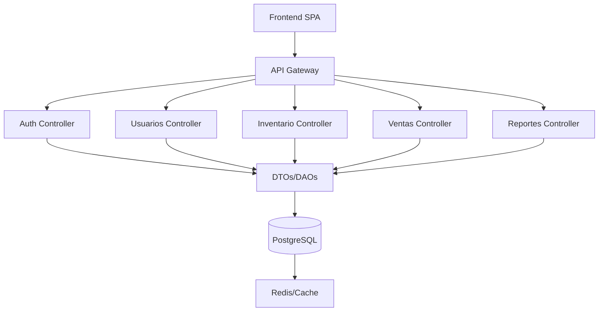

# 🚀 Backend - Sistema de Inventario PYMES

Backend del sistema integral de inventario, ventas y facturación para PYMES. Construido con **Node.js** + **Express**, utiliza **SQLite/PostgreSQL** mediante **Sequelize ORM**, implementando autenticación JWT y arquitectura por capas escalable.

## 🛠️ Tecnologías

## ⚡ Características Principales

- 🔐 **Autenticación JWT**: Sistema seguro de login y gestión de sesiones
- 👥 **Roles y Permisos**: Control granular de acceso (Owner, Admin, Supervisor, Cajero)
- 🏢 **Multi-sucursal**: Gestión independiente por ubicación
- 📦 **CRUD Completo**: Productos, usuarios, clientes, inventario, ventas
- 🛒 **API POS**: Endpoints optimizados para punto de venta
- 📊 **Reportes**: Generación de informes de ventas e inventario
- 🔄 **Migraciones**: Versionado de esquema de base de datos
- 🌱 **Seeders**: Datos de prueba y configuración inicial

## 🛠️ Tecnologías

| Tecnología | Versión | Descripción |
|------------|---------|-------------|
| **Node.js** | v18+ | Runtime JavaScript para backend |
| **Express** | v4.18+ | Framework web minimalista y flexible |
| **Sequelize** | v6.35+ | ORM para bases de datos relacionales |
| **SQLite** | v3+ | Base de datos para desarrollo |
| **JWT** | - | Autenticación stateless |
| **bcrypt** | - | Encriptación de contraseñas |
| **UUID** | - | Identificadores únicos |
| **CORS** | - | Control de acceso entre orígenes |

## 📦 Estructura del Proyecto
### Diagrama
* 🧩 **Modelo Vista Controlador (MVC):** Separación clara entre datos, lógica y presentación.
* 📦 **DTOs (Data Transfer Objects):** Estructuras para transferir datos entre capas.
* 🗄️ **DAOs (Data Access Objects):** Abstracción para acceso y manipulación de datos.
* 🧱 **Microservicios:** Módulos críticos escalables.
* 🏗️ **Monolito Modular:** Fácil migración a microservicios.


### Estructura Actual del Proyecto
```
/api
├── /src
│   ├── app.js                 # Configuración principal de Express
│   ├── server.js              # Servidor HTTP y configuración
│   ├── /config                # Configuración y conexiones
│   │   ├── database.js        # Configuración de Sequelize
│   │   ├── sequelize.js       # Instancia de Sequelize
│   │   ├── swagger.js         # Documentación API
│   │   └── index.js           # Exportaciones de config
│   ├── /infrastructure        # Capa de infraestructura
│   │   ├── /controllers       # Controladores de dominio
│   │   │   ├── authController.js      # Autenticación
│   │   │   ├── userController.js      # Gestión de usuarios
│   │   │   ├── branchController.js    # Gestión de sucursales
│   │   │   ├── productController.js   # Gestión de productos
│   │   │   ├── customerController.js  # Gestión de clientes
│   │   │   ├── inventoryController.js # Control de inventario
│   │   │   ├── saleController.js      # Procesamiento de ventas
│   │   │   ├── paymentController.js   # Métodos de pago
│   │   │   ├── returnController.js    # Devoluciones
│   │   │   └── reportController.js    # Reportes y analytics
│   │   ├── /database          # Persistencia de datos
│   │   │   ├── /models        # Modelos de Sequelize
│   │   │   ├── /migrations    # Migraciones de BD
│   │   │   └── /seeders       # Datos de prueba
│   │   └── /routes            # Definición de rutas
│   │       ├── auth.js        # Rutas de autenticación
│   │       ├── usersRoute.js  # CRUD usuarios
│   │       ├── branchesRoute.js # CRUD sucursales
│   │       ├── productsRoute.js # CRUD productos
│   │       ├── customersRoute.js # CRUD clientes
│   │       ├── inventoryRoute.js # Gestión inventario
│   │       ├── salesRoute.js    # Procesamiento ventas
│   │       ├── paymentRoute.js  # Métodos de pago
│   │       ├── returnsRoute.js  # Devoluciones
│   │       └── index.js         # Router principal
│   ├── /middleware            # Middlewares personalizados
│   │   └── auth.js           # Verificación JWT y permisos
│   ├── /services             # Lógica de negocio
│   │   └── index.js          # Servicios de dominio
│   └── /utils                # Utilidades compartidas
│       └── index.js          # Funciones auxiliares
├── package.json              # Dependencias y scripts
└── .env                     # Variables de entorno
```

## ⚙️ Instalación y Configuración

### 1. Instalación de Dependencias
```bash
# desde la carpeta /api
npm install
```

### 2. Variables de Entorno
Crea un archivo `.env` en la carpeta `/api`:
```env
# Puerto del servidor
PORT=3001

# Base de datos SQLite (desarrollo)
DB_STORAGE=./database.sqlite
DB_DIALECT=sqlite

# JWT
JWT_SECRET=your-secret-key-here
JWT_EXPIRES_IN=24h

# Configuración de desarrollo
NODE_ENV=development

# Para producción con PostgreSQL
# DB_HOST=localhost
# DB_PORT=5432
# DB_USER=username
# DB_PASSWORD=password
# DB_NAME=database_name
# DB_DIALECT=postgres
```

### 3. Configuración de Base de Datos
```bash
# Ejecutar migraciones
npm run migrate

# Ejecutar seeders (datos de prueba)
npm run seed

# Reset completo de BD
npm run db:reset
```

## 🚀 Ejecutar el Servidor

### Desarrollo
```bash
npm run dev
```
Servidor disponible en `http://localhost:3001`

### Producción
```bash
npm start
```

## 🔐 Autenticación

### Endpoints Principales
- `POST /api/auth/login` - Login de usuario
- `POST /api/auth/register` - Registro de usuario
- `GET /api/auth/me` - Información del usuario actual

### Headers Requeridos
```javascript
Authorization: Bearer <jwt-token>
Content-Type: application/json
```

## 📚 API Endpoints

### Usuarios
- `GET /api/users` - Listar usuarios
- `POST /api/users` - Crear usuario
- `GET /api/users/:id` - Obtener usuario
- `PUT /api/users/:id` - Actualizar usuario
- `DELETE /api/users/:id` - Eliminar usuario

### Sucursales
- `GET /api/branches` - Listar sucursales
- `POST /api/branches` - Crear sucursal
- `GET /api/branches/:id` - Obtener sucursal
- `PUT /api/branches/:id` - Actualizar sucursal
- `DELETE /api/branches/:id` - Eliminar sucursal

### Productos
- `GET /api/products` - Listar productos
- `POST /api/products` - Crear producto
- `GET /api/products/:id` - Obtener producto
- `PUT /api/products/:id` - Actualizar producto
- `DELETE /api/products/:id` - Eliminar producto

### Inventario
- `GET /api/inventory` - Estado del inventario
- `POST /api/inventory/movement` - Registrar movimiento
- `GET /api/inventory/alerts` - Alertas de stock bajo

### Ventas
- `GET /api/sales` - Listar ventas
- `POST /api/sales` - Procesar venta
- `GET /api/sales/:id` - Obtener venta específica
- `POST /api/sales/:id/void` - Anular venta

## 🛡️ Middleware de Seguridad

### Verificación JWT
```javascript
// middleware/auth.js
const verifyToken = (req, res, next) => {
  const token = req.headers.authorization?.split(' ')[1];
  // Verificación y decodificación del token
};
```

### Control de Roles
```javascript
const hasPermission = (roles) => (req, res, next) => {
  if (roles.includes(req.user.role)) {
    next();
  } else {
    res.status(403).json({ error: 'Acceso denegado' });
  }
};
```

## 🔄 Actualizaciones Recientes

### v2.0.0
- ✅ **CRUD Sucursales**: Formulario completo con validaciones
- ✅ **Asociaciones Sequelize**: Corrección de aliases inconsistentes  
- ✅ **Validación Mejorada**: Manejo de campos opcionales (manager_id)
- ✅ **Campos Agregados**: code, city, state, postal_code, email en branches
- ✅ **Manejo de Errores**: Conversión string vacío → null para FKs
- ✅ **Estructura Optimizada**: Separación clara de responsabilidades

## 📚 Documentación

- [Express](https://expressjs.com/)
- [Node.js](https://nodejs.org/)
- [PostgreSQL](https://www.postgresql.org/)
- [Clean Architecture](https://github.com/jeffreypalermo/cleanarchitecture)
- [Hexagonal Architecture](https://alistair.cockburn.us/hexagonal-architecture/)


