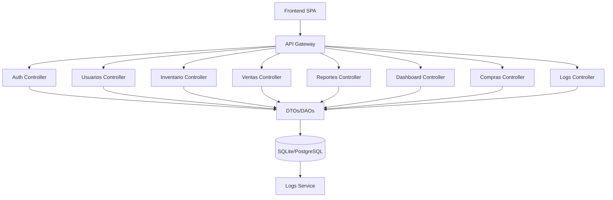

# 🚀 Backend - Sistema de Inventario PYMES

Backend del sistema integral de inventario, ventas y facturación para PYMES. Construido con **Node.js** + **Express**, utiliza **SQLite/PostgreSQL** mediante **Sequelize ORM**, implementando autenticación JWT y arquitectura por capas escalable.

## ⚡ Características Principales

- 🔐 **Autenticación JWT**: Sistema seguro de login, recuperación de contraseña y gestión de sesiones
- 👥 **Roles y Permisos**: Control granular de acceso (Owner, Admin, Supervisor, Cajero)
- 🏢 **Multi-sucursal**: Gestión independiente por ubicación con asignación de usuarios
- 📦 **CRUD Completo**: Productos, usuarios, clientes, inventario, ventas, compras
- 🛒 **API POS**: Endpoints optimizados para punto de venta
- 📊 **Dashboard**: Estadísticas en tiempo real, productos más vendidos, stock bajo
- 📈 **Reportes**: Generación de informes de ventas e inventario
- 🔄 **Devoluciones**: Sistema completo de gestión de devoluciones con aprobación
- 💰 **Compras**: Registro y gestión de compras a proveedores
- ⚙️ **Configuraciones**: Sistema de configuración por categorías
- 📝 **Logs del Sistema**: Auditoría completa de acciones del sistema
- 🔄 **Migraciones**: Versionado de esquema de base de datos
- 🌱 **Seeders**: Datos de prueba y configuración inicial
- 📚 **Swagger**: Documentación interactiva de la API

## 🛠️ Tecnologías

| Tecnología | Versión | Descripción |
|------------|---------|-------------|
| **Node.js** | v18+ | Runtime JavaScript para backend |
| **Express** | v5.1+ | Framework web minimalista y flexible |
| **Sequelize** | v6.37+ | ORM para bases de datos relacionales |
| **SQLite** | v3+ | Base de datos para desarrollo |
| **PostgreSQL** | - | Base de datos para producción |
| **JWT** | v9.0+ | Autenticación stateless |
| **bcryptjs** | v3.0+ | Encriptación de contraseñas |
| **UUID** | v13.0+ | Identificadores únicos |
| **CORS** | v2.8+ | Control de acceso entre orígenes |
| **Swagger** | v6.2+ | Documentación interactiva de API |
| **Joi** | v18.0+ | Validación de esquemas |
| **Helmet** | v8.1+ | Seguridad HTTP headers |
| **Morgan** | v1.10+ | Logger de peticiones HTTP |
| **Express Rate Limit** | v8.1+ | Limitación de tasa de peticiones |

## 📦 Estructura del Proyecto

### Diagrama de Arquitectura
* 🧩 **Modelo Vista Controlador (MVC):** Separación clara entre datos, lógica y presentación.
* 📦 **DTOs (Data Transfer Objects):** Estructuras para transferir datos entre capas.
* 🗄️ **DAOs (Data Access Objects):** Abstracción para acceso y manipulación de datos.
* 🧱 **Microservicios:** Módulos críticos escalables.
* 🏗️ **Monolito Modular:** Fácil migración a microservicios.



### Estructura Actual del Proyecto
```
/api
├── /src
│   ├── app.js                      # Configuración principal de Express
│   ├── server.js                   # Servidor HTTP y configuración
│   ├── /config                      # Configuración y conexiones
│   │   ├── database.js              # Configuración de Sequelize
│   │   ├── sequelize.js             # Instancia de Sequelize
│   │   ├── swagger.js               # Documentación API Swagger
│   │   └── index.js                 # Exportaciones de config
│   ├── /infrastructure              # Capa de infraestructura
│   │   ├── /controllers             # Controladores de dominio
│   │   │   ├── authController.js    # Autenticación y autorización
│   │   │   ├── userController.js    # Gestión de usuarios
│   │   │   ├── branchController.js  # Gestión de sucursales
│   │   │   ├── productController.js # Gestión de productos
│   │   │   ├── customerController.js # Gestión de clientes
│   │   │   ├── inventoryController.js # Control de inventario
│   │   │   ├── saleController.js    # Procesamiento de ventas
│   │   │   ├── saleItemController.js # Items de venta
│   │   │   ├── paymentController.js # Métodos de pago
│   │   │   ├── returnController.js  # Devoluciones
│   │   │   ├── purchaseController.js # Compras a proveedores
│   │   │   ├── reportController.js  # Reportes y analytics
│   │   │   ├── dashboardController.js # Dashboard y estadísticas
│   │   │   ├── settingController.js # Configuraciones del sistema
│   │   │   └── logController.js     # Logs del sistema
│   │   ├── /database                # Persistencia de datos
│   │   │   ├── /models              # Modelos de Sequelize
│   │   │   │   ├── User.js
│   │   │   │   ├── Branch.js
│   │   │   │   ├── Product.js
│   │   │   │   ├── Customer.js
│   │   │   │   ├── Inventory.js
│   │   │   │   ├── Sales.js
│   │   │   │   ├── SaleItem.js
│   │   │   │   ├── Payment.js
│   │   │   │   ├── Return.js
│   │   │   │   ├── Purchase.js
│   │   │   │   ├── Report.js
│   │   │   │   ├── Setting.js
│   │   │   │   └── Log.js
│   │   │   ├── /migrations         # Migraciones de BD
│   │   │   └── /seeders             # Datos de prueba
│   │   └── /routes                  # Definición de rutas
│   │       ├── auth.js              # Rutas de autenticación
│   │       ├── usersRoute.js        # CRUD usuarios
│   │       ├── branchesRoute.js     # CRUD sucursales
│   │       ├── productsRoute.js     # CRUD productos
│   │       ├── customersRoute.js    # CRUD clientes
│   │       ├── inventoryRoute.js    # Gestión inventario
│   │       ├── salesRoute.js        # Procesamiento ventas
│   │       ├── paymentRoute.js      # Métodos de pago
│   │       ├── returnsRoute.js      # Devoluciones
│   │       ├── purchasesRoute.js   # Compras
│   │       ├── reportsRoute.js      # Reportes
│   │       ├── dashboardRoute.js    # Dashboard
│   │       ├── settingsRoute.js     # Configuraciones
│   │       ├── logsRoute.js         # Logs
│   │       └── index.js             # Router principal
│   ├── /middleware                  # Middlewares personalizados
│   │   └── auth.js                  # Verificación JWT y permisos
│   ├── /services                    # Lógica de negocio
│   │   ├── index.js                 # Servicios de dominio
│   │   └── logService.js            # Servicio de logs
│   └── /utils                       # Utilidades compartidas
│       └── index.js                 # Funciones auxiliares
├── package.json                     # Dependencias y scripts
└── .env                            # Variables de entorno
```

## 🚀 Inicialización del Proyecto

### Requisitos Previos

Antes de comenzar, asegúrate de tener instalado:

- **Node.js** v18 o superior ([Descargar Node.js](https://nodejs.org/))
- **npm** (viene incluido con Node.js) o **yarn**
- **Git** (opcional, para clonar el repositorio)

### Paso 1: Clonar o Navegar al Proyecto

Si estás clonando desde un repositorio:
```bash
git clone <url-del-repositorio>
cd project-web/api
```

Si ya tienes el proyecto:
```bash
cd api
```

### Paso 2: Instalar Dependencias

Instala todas las dependencias necesarias del proyecto:
```bash
npm install
```

Esto instalará todas las dependencias listadas en `package.json`, incluyendo:
- Express, Sequelize, JWT, bcryptjs
- Swagger, Joi, Helmet, Morgan
- Y todas las demás dependencias del proyecto

### Paso 3: Configurar Variables de Entorno

Crea un archivo `.env` en la carpeta `/api` con la siguiente configuración:

**Para desarrollo (SQLite):**
```env
# Puerto del servidor
PORT=3001

# Base de datos SQLite (desarrollo)
DB_STORAGE=./src/infrastructure/database/database.sqlite
DB_DIALECT=sqlite

# JWT - IMPORTANTE: Cambia este valor por una clave secreta segura
JWT_SECRET=tu-clave-secreta-super-segura-aqui-minimo-32-caracteres
JWT_EXPIRES_IN=24h

# Configuración de desarrollo
NODE_ENV=development
```

**Para producción (PostgreSQL):**
```env
# Puerto del servidor
PORT=3001

# Base de datos PostgreSQL
DB_HOST=localhost
DB_PORT=5432
DB_USER=tu_usuario
DB_PASSWORD=tu_contraseña
DB_NAME=nombre_base_datos
DB_DIALECT=postgres

# JWT
JWT_SECRET=tu-clave-secreta-super-segura-aqui-minimo-32-caracteres
JWT_EXPIRES_IN=24h

# Configuración de producción
NODE_ENV=production
```

> ⚠️ **Importante:** 
> - Nunca compartas tu archivo `.env` o lo subas al repositorio
> - Genera una clave JWT_SECRET segura y única (mínimo 32 caracteres)
> - Para producción, usa variables de entorno del sistema o un gestor de secretos

### Paso 4: Configurar la Base de Datos

#### Opción A: SQLite (Desarrollo - Recomendado para empezar)

SQLite no requiere instalación adicional. Solo ejecuta las migraciones:

```bash
# Ejecutar migraciones para crear las tablas
npm run migrate

# Verificar que las migraciones se ejecutaron correctamente
npm run db:status
```

#### Opción B: PostgreSQL (Producción)

1. **Instalar PostgreSQL:**
   - Windows: [Descargar PostgreSQL](https://www.postgresql.org/download/windows/)
   - macOS: `brew install postgresql`
   - Linux: `sudo apt-get install postgresql`

2. **Crear la base de datos:**
```bash
# Conectarse a PostgreSQL
psql -U postgres

# Crear la base de datos
CREATE DATABASE nombre_base_datos;

# Salir de psql
\q
```

3. **Ejecutar migraciones:**
```bash
npm run migrate
```

### Paso 5: Poblar la Base de Datos con Datos de Prueba

Ejecuta los seeders para crear datos iniciales (usuarios, productos, sucursales, etc.):

```bash
# Ejecutar seeders (datos de prueba)
npm run seed
```

Esto creará:
- ✅ Usuarios de prueba con diferentes roles
- ✅ Sucursales de ejemplo
- ✅ Productos de muestra
- ✅ Clientes de prueba
- ✅ Inventario inicial
- ✅ Métodos de pago
- ✅ Configuraciones del sistema

> 💡 **Nota:** Si necesitas reiniciar con datos frescos:
> ```bash
> npm run seed:force  # Elimina datos existentes y crea nuevos
> ```

### Paso 6: Verificar la Instalación

Verifica que todo esté configurado correctamente:

```bash
# Verificar estado de migraciones
npm run db:status

# Deberías ver todas las migraciones como "up"
```

### Paso 7: Iniciar el Servidor

#### Modo Desarrollo (con recarga automática):
```bash
npm run dev
```

#### Modo Producción:
```bash
npm start
```

Si todo está correcto, verás un mensaje similar a:
```
✅ Servidor corriendo en puerto 3001
✅ Base de datos conectada
✅ Swagger disponible en http://localhost:3001/api-docs
```

### Paso 8: Verificar que Funciona

1. **Verificar el servidor:**
   - Abre tu navegador en: `http://localhost:3001`
   - Deberías ver un mensaje JSON con información de la API

2. **Acceder a Swagger (Documentación):**
   - Abre: `http://localhost:3001/api-docs`
   - Aquí podrás ver y probar todos los endpoints

3. **Probar el login:**
   - Usa Swagger o Postman para hacer un POST a `/api/auth/login`
   - Credenciales de prueba (creadas por los seeders):
     - **Owner:** `edgar_gmz@apexstore.com` / `edgar1234`
     - **Admin:** `alexis@apexstore.com` / `alexis1234`
     - **Supervisor:** `orlando@apexstore.com` / `orlando1234`
     - **Cajero:** `juan@apexstore.com` / `juan1234`
     - **Cajero:** `daniela@apexstore.com` / `daniela1234`

### ✅ Inicialización Completa

Si has seguido todos los pasos, tu proyecto debería estar:
- ✅ Dependencias instaladas
- ✅ Variables de entorno configuradas
- ✅ Base de datos creada y migrada
- ✅ Datos de prueba cargados
- ✅ Servidor corriendo
- ✅ API accesible y documentada

## ⚙️ Comandos Útiles

### Gestión de Base de Datos
```bash
# Ejecutar migraciones
npm run migrate

# Revertir última migración
npm run migrate:undo

# Ver estado de migraciones
npm run db:status

# Ejecutar seeders
npm run seed

# Forzar seeders (elimina datos existentes)
npm run seed:force

# Reset completo de BD (elimina, crea y pobla)
npm run db:reset

# Eliminar BD y crear nueva (sin seeders)
npm run db:fresh

# Eliminar base de datos
npm run db:drop
```

### Desarrollo
```bash
# Iniciar servidor en modo desarrollo
npm run dev

# Iniciar servidor en modo producción
npm start
```

## 📚 Documentación Swagger

Una vez que el servidor esté corriendo, accede a la documentación interactiva de la API en:

```
http://localhost:3001/api-docs
```

En Swagger podrás:
- 📖 Ver todos los endpoints disponibles
- 🔍 Explorar los esquemas de datos
- 🧪 Probar los endpoints directamente desde el navegador
- 📝 Ver ejemplos de requests y responses

## 🔐 Autenticación

### Endpoints Principales
- `POST /api/auth/login` - Iniciar sesión
- `GET /api/auth/profile` - Obtener perfil del usuario actual
- `PUT /api/auth/profile` - Actualizar perfil
- `PUT /api/auth/change-password` - Cambiar contraseña
- `POST /api/auth/logout` - Cerrar sesión
- `POST /api/auth/verify-password` - Verificar contraseña del usuario actual
- `POST /api/auth/forgot-password` - Solicitar recuperación de contraseña
- `POST /api/auth/reset-password` - Restablecer contraseña con token
- `GET /api/auth/verify-reset-token/:token` - Verificar si un token de reset es válido

### Headers Requeridos
```javascript
Authorization: Bearer <jwt-token>
Content-Type: application/json
```

**Nota:** El endpoint de registro (`/api/auth/register`) fue eliminado por lógica de negocio. El primer usuario (dueño) se crea manualmente y solo usuarios autenticados con permisos pueden crear más usuarios.

## 📚 API Endpoints

### 🔑 Autenticación (`/api/auth`)
- `POST /login` - Iniciar sesión
- `GET /profile` - Obtener perfil (requiere autenticación)
- `PUT /profile` - Actualizar perfil (requiere autenticación)
- `PUT /change-password` - Cambiar contraseña (requiere autenticación)
- `POST /logout` - Cerrar sesión (requiere autenticación)
- `POST /verify-password` - Verificar contraseña (requiere autenticación)
- `POST /forgot-password` - Solicitar recuperación de contraseña
- `POST /reset-password` - Restablecer contraseña con token
- `GET /verify-reset-token/:token` - Verificar token de reset

### 👥 Usuarios (`/api/users`)
**Permisos requeridos:** Owner
- `GET /` - Listar usuarios
- `GET /:id` - Obtener usuario por ID
- `POST /` - Crear usuario
- `PUT /:id` - Actualizar usuario
- `DELETE /:id` - Eliminar usuario

### 🏢 Sucursales (`/api/branches`)
- `GET /` - Listar sucursales (requiere autenticación)
- `GET /:id` - Obtener sucursal por ID (requiere autenticación)
- `POST /` - Crear sucursal (requiere Owner)
- `PUT /:id` - Actualizar sucursal (requiere Owner)
- `DELETE /:id` - Eliminar sucursal (requiere Owner)
- `PUT /:id/assign-users` - Asignar usuarios a sucursal (requiere Owner)

### 📦 Productos (`/api/products`)
- `GET /` - Listar productos (público)
- `GET /:id` - Obtener producto por ID (público)
- `POST /` - Crear producto (requiere Owner)
- `PUT /:id` - Actualizar producto (requiere Owner, Supervisor)
- `PATCH /:id/toggle-status` - Activar/desactivar producto (requiere Owner, Supervisor)
- `DELETE /:id` - Eliminar producto (requiere Owner, Supervisor)

### 👤 Clientes (`/api/customers`)
**Permisos requeridos:** Owner, Supervisor, Cajero (según operación)
- `GET /` - Listar clientes
- `GET /:id` - Obtener cliente por ID
- `GET /:id/details` - Obtener detalles completos del cliente
- `POST /` - Crear cliente (requiere Cajero)
- `PUT /:id` - Actualizar cliente (requiere Supervisor, Cajero)
- `DELETE /:id` - Eliminar cliente (requiere Supervisor)

### 📊 Inventario (`/api/inventory`)
**Permisos requeridos:** Owner, Admin (según operación)
- `GET /` - Estado del inventario (filtrado por sucursal)
- `GET /:id` - Obtener inventario por ID
- `POST /` - Crear registro de inventario (requiere Admin)
- `PUT /:id` - Actualizar inventario (requiere Owner, Admin)
- `DELETE /:id` - Eliminar inventario (requiere Owner, Admin)
- `PUT /:id/adjust` - Ajustar stock (requiere Owner, Admin)

### 🛒 Ventas (`/api/sales`)
**Permisos requeridos:** Supervisor, Cajero (según operación)
- `GET /` - Listar ventas
- `GET /:id` - Obtener venta por ID
- `POST /` - Procesar venta (requiere Cajero)
- `PUT /:id` - Actualizar venta (requiere Cajero)
- `DELETE /:id` - Cancelar venta (requiere Cajero)

### 💳 Pagos (`/api/payment`)
**Permisos requeridos:** Owner
- `GET /` - Listar métodos de pago
- `GET /:id` - Obtener método de pago por ID
- `POST /` - Crear método de pago
- `PUT /:id` - Actualizar método de pago
- `DELETE /:id` - Eliminar método de pago

### 🔄 Devoluciones (`/api/returns`)
**Permisos requeridos:** Owner, Admin, Supervisor, Cajero (según operación)
- `GET /` - Listar devoluciones
- `GET /sale` - Obtener venta por referencia
- `GET /:id` - Obtener devolución por ID
- `POST /` - Crear devolución (requiere Admin, Cajero)
- `PUT /:id` - Actualizar devolución (requiere Admin, Supervisor)
- `DELETE /:id` - Eliminar devolución (requiere Admin, Supervisor)

### 🛍️ Compras (`/api/purchases`)
**Permisos requeridos:** Owner
- `GET /` - Listar compras
- `GET /:id` - Obtener compra por ID
- `POST /` - Crear compra
- `PUT /:id` - Actualizar compra
- `DELETE /:id` - Eliminar compra

### 📈 Reportes (`/api/reports`)
**Permisos requeridos:** Owner, Admin
- `GET /` - Listar reportes
- `GET /:id` - Obtener reporte por ID
- `POST /` - Crear reporte
- `PUT /:id` - Actualizar reporte
- `DELETE /:id` - Eliminar reporte

### 📊 Dashboard (`/api/dashboard`)
**Requiere autenticación**
- `GET /stats` - Estadísticas generales
- `GET /recent-sales` - Ventas recientes
- `GET /top-products` - Productos más vendidos
- `GET /low-stock` - Productos con stock bajo

### ⚙️ Configuraciones (`/api/settings`)
**Requiere autenticación**
- `GET /` - Obtener todas las configuraciones
- `GET /:category` - Obtener configuraciones por categoría
- `PUT /:category` - Actualizar configuraciones por categoría
- `POST /:category/reset` - Restablecer configuraciones a valores por defecto

### 📝 Logs (`/api/logs`)
**Permisos requeridos:** Owner (para lectura), cualquier usuario autenticado (para creación)
- `GET /` - Listar logs (requiere Owner)
- `GET /stats` - Estadísticas de logs (requiere Owner)
- `GET /user/:userId` - Logs de un usuario específico (requiere Owner)
- `GET /:id` - Obtener log por ID (requiere Owner)
- `POST /` - Crear log (cualquier usuario autenticado)
- `DELETE /cleanup` - Eliminar logs antiguos (requiere Owner)

## 🛡️ Middleware de Seguridad

### Verificación JWT
```javascript
// middleware/auth.js
const authenticate = (req, res, next) => {
  const token = req.headers.authorization?.split(' ')[1];
  // Verificación y decodificación del token
  // Agrega req.user con información del usuario
};
```

### Control de Roles
```javascript
const authorize = (...roles) => (req, res, next) => {
  if (roles.includes(req.user.role)) {
    next();
  } else {
    res.status(403).json({ error: 'Acceso denegado' });
  }
};
```

### Seguridad Adicional
- **Helmet**: Configuración de headers HTTP seguros
- **CORS**: Control de acceso entre orígenes
- **Rate Limiting**: Limitación de peticiones por IP
- **Morgan**: Logging de peticiones HTTP

## 👥 Roles y Permisos

| Rol | Descripción | Permisos |
|-----|-------------|----------|
| **Owner** | Dueño del negocio | Acceso completo a todas las funcionalidades |
| **Admin** | Administrador | Gestión de inventario, reportes, devoluciones |
| **Supervisor** | Supervisor | Gestión de ventas, clientes, productos |
| **Cajero** | Cajero | Procesamiento de ventas, creación de clientes |

## 🔄 Actualizaciones Recientes

### v3.0.0
- ✅ **Sistema de Dashboard**: Estadísticas en tiempo real, productos más vendidos, stock bajo
- ✅ **Gestión de Compras**: CRUD completo de compras a proveedores
- ✅ **Sistema de Configuraciones**: Configuración por categorías con valores por defecto
- ✅ **Sistema de Logs**: Auditoría completa de acciones del sistema
- ✅ **Recuperación de Contraseña**: Sistema completo de forgot/reset password
- ✅ **Gestión de Devoluciones**: Sistema completo con aprobación y rechazo
- ✅ **Documentación Swagger**: Documentación interactiva de la API
- ✅ **Validación con Joi**: Validación robusta de esquemas
- ✅ **Seguridad Mejorada**: Helmet, rate limiting, mejor manejo de errores

### v2.0.0
- ✅ **CRUD Sucursales**: Formulario completo con validaciones
- ✅ **Asociaciones Sequelize**: Corrección de aliases inconsistentes  
- ✅ **Validación Mejorada**: Manejo de campos opcionales (manager_id)
- ✅ **Campos Agregados**: code, city, state, postal_code, email en branches
- ✅ **Manejo de Errores**: Conversión string vacío → null para FKs
- ✅ **Estructura Optimizada**: Separación clara de responsabilidades

## 📚 Documentación

- [Express](https://expressjs.com/)
- [Node.js](https://nodejs.org/)
- [Sequelize](https://sequelize.org/)
- [PostgreSQL](https://www.postgresql.org/)
- [Swagger](https://swagger.io/)
- [JWT](https://jwt.io/)
- [Clean Architecture](https://github.com/jeffreypalermo/cleanarchitecture)
- [Hexagonal Architecture](https://alistair.cockburn.us/hexagonal-architecture/)

## 📝 Scripts Disponibles

```bash
# Desarrollo
npm run dev              # Iniciar servidor en modo desarrollo

# Producción
npm start                # Iniciar servidor en modo producción

# Base de datos
npm run migrate          # Ejecutar migraciones
npm run migrate:undo     # Revertir última migración
npm run seed             # Ejecutar seeders
npm run seed:force       # Forzar seeders (elimina datos existentes)
npm run db:reset         # Reset completo de BD
npm run db:fresh         # Eliminar BD y crear nueva (sin seeders)
npm run db:drop          # Eliminar base de datos
npm run db:status        # Ver estado de migraciones
```

## 🐛 Troubleshooting

### Error de conexión a la base de datos
- Verifica que el archivo `.env` esté configurado correctamente
- Asegúrate de que las migraciones se hayan ejecutado: `npm run migrate`

### Error de autenticación
- Verifica que `JWT_SECRET` esté configurado en `.env`
- Asegúrate de enviar el token en el header: `Authorization: Bearer <token>`

### Error de permisos
- Verifica que el usuario tenga el rol necesario para la operación
- Consulta la tabla de roles y permisos en la sección correspondiente
