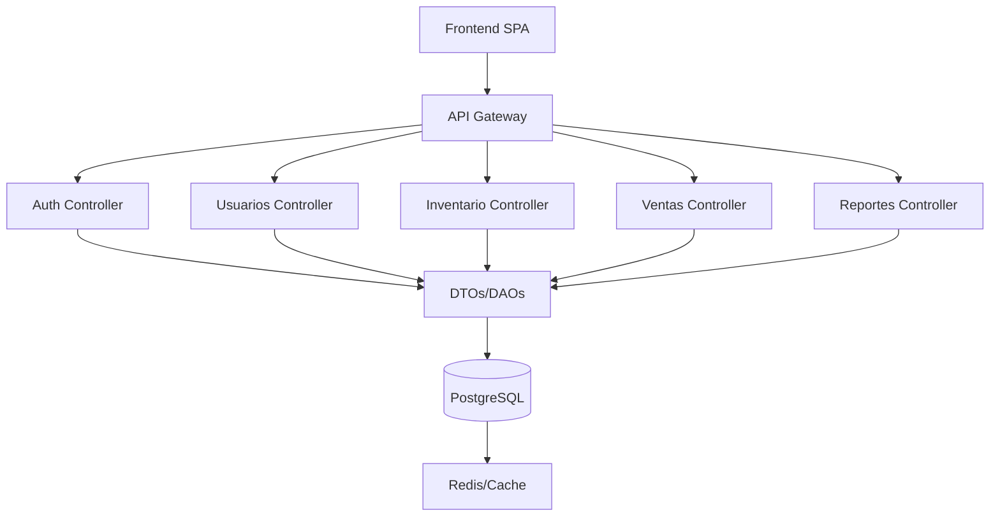

# 🚀 Backend

Bienvenido al backend del proyecto. Este servicio está construido con **Node.js** + **Express**, utiliza **PostgreSQL** como base de datos mediante un **ORM**, y sigue la arquitectura **Clean/Hexagonal** con enfoque en **Microservicios**.

## 🛠️ Tecnologías

| Tecnología | Descripción | Documentación/Descarga |
|------------|-------------|------------------------|
|  <br/> **Node.js** | Motor JavaScript para backend, eficiente y escalable. | [Node.js](https://nodejs.org/) |
|  <br/> **Express** | Framework minimalista para APIs rápidas y sencillas. | [Express](https://expressjs.com/) |
|  <br/> **PostgreSQL (v16.10)** | Base de datos relacional robusta y open source. | [PostgreSQL](https://www.postgresql.org/download/) |
|  <br/> **ORM**<br/>(Sequelize/TypeORM) | Abstracción para interactuar con la base de datos usando objetos y migraciones. | [Sequelize](https://sequelize.org/)<br/>[TypeORM](https://typeorm.io/) |
|  <br/> **Modelo Vista Controlador (MVC)** | Separación clara entre datos, lógica y presentación. | [MVC](https://developer.mozilla.org/es/docs/Glossary/MVC) |
|  <br/> **Microservicios** | Permite escalabilidad y mantenimiento dividiendo el sistema en módulos. | [Microservices](https://microservices.io/) |

## 📦 Estructura del Proyecto
### Diagrama
* 🧩 **Modelo Vista Controlador (MVC):** Separación clara entre datos, lógica y presentación.
* 📦 **DTOs (Data Transfer Objects):** Estructuras para transferir datos entre capas.
* 🗄️ **DAOs (Data Access Objects):** Abstracción para acceso y manipulación de datos.
* 🧱 **Microservicios:** Módulos críticos escalables.
* 🏗️ **Monolito Modular:** Fácil migración a microservicios.


### Estructuración de Carpetas (Modelo Vista Controlador - MVC + DTOs/DAOs)
```
/src
     /controllers   # Lógica de control y manejo de rutas
     /models        # Definición de modelos y esquemas de datos
     /views         # Plantillas y presentación (si aplica)
     /routes        # Definición de rutas de la API
     /middlewares   # Funciones intermedias para manejo de peticiones
     /config        # Configuración general y variables de entorno
     /utils         # Funciones y utilidades compartidas
     /dtos          # Objetos de transferencia de datos (DTOs)
     /daos          # Objetos de acceso a datos (DAOs)
```

## ⚙️ Instalación

1. **Clona el repositorio**
     ```bash
     git clone https://github.com/tu-usuario/tu-repo.git
     cd tu-repo/api
     ```

2. **Instala dependencias**
     ```bash
     npm install
     ```

3. **Configura variables de entorno**
     Crea un archivo `.env` con la configuración de tu base de datos PostgreSQL:
     ```
     DB_HOST=localhost
     DB_PORT=5432
     DB_USER=usuario
     DB_PASSWORD=contraseña
     DB_NAME=nombre_db
     ```

4. **Ejecuta migraciones (si aplica)**
     ```bash
     npm run migrate
     ```

## ▶️ Levantar el Backend

```bash
npm run dev
```
El servidor estará disponible en `http://localhost:3000`.

## 🧪 Pruebas

```bash
npm test
```

## 📚 Documentación

- [Express](https://expressjs.com/)
- [Node.js](https://nodejs.org/)
- [PostgreSQL](https://www.postgresql.org/)
- [Clean Architecture](https://github.com/jeffreypalermo/cleanarchitecture)
- [Hexagonal Architecture](https://alistair.cockburn.us/hexagonal-architecture/)


